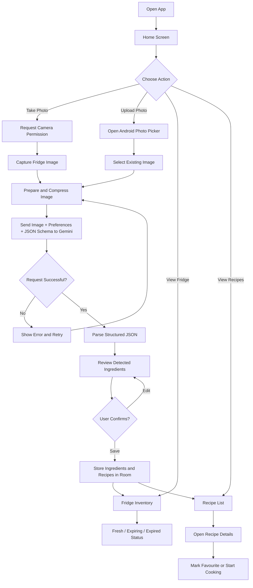
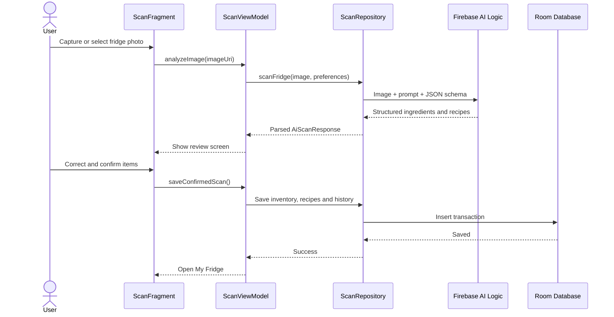

# Lighture — AI Fridge & Meal Planner

An Android application that helps users identify food in their fridge, maintain a simple inventory, and generate meal ideas from available ingredients.

The app is being built with **Android Studio**, **Java**, and **XML layouts**.

> Project status: Planning and MVP development  
> Working package name: `com.example.lighture`  
> Minimum Android version: Android 7.0, API 24  
> Compile/target SDK: API 37  
> Primary test device: Pixel 9 emulator, API 37, Google Play x86_64

---

## 1. Project concept

### Problem

People often:

- Forget which ingredients are already in their fridge.
- Buy duplicate groceries.
- Allow food to expire before using it.
- Struggle to decide what to cook.
- Waste money and food.

### Solution

Lighture allows a user to:

1. Take a photo of the inside of their fridge.
2. Send the image to a multimodal Gemini model.
3. Detect visible ingredients.
4. Review and correct the detected items.
5. Save confirmed ingredients to a local fridge inventory.
6. Generate recipes using available ingredients.
7. Track estimated freshness using dates and typical shelf life.

### Main benefits

- Reduces food waste.
- Helps users save money.
- Makes meal planning easier.
- Encourages users to cook with ingredients they already own.
- Keeps a simple record of fridge contents.

---

## 2. MVP scope

The first release must remain focused. It should prove the complete photo-to-recipe workflow before advanced features are added.

### Included in the MVP

- Home screen.
- Fridge inventory screen.
- Recipe list and recipe details.
- Profile and basic preference screens.
- Camera photo capture using CameraX.
- Uploading an existing photo using Android Photo Picker.
- Gemini image analysis.
- Structured JSON response containing ingredients and recipes.
- User confirmation and editing of detected ingredients.
- Local storage with Room.
- Basic freshness status:
  - Fresh
  - Expiring soon
  - Expired
- Search, filter, and sort for fridge items and recipes.
- Loading, empty, success, and error states.
- Basic dietary preferences and allergies.
- Scan history.
- Offline viewing of previously saved inventory and recipes.

### Not required for the first MVP

These features should be displayed as **Coming Soon** where necessary, but should not delay the first working release:

- Continuous live camera recognition.
- A custom-trained computer vision model.
- Exact quantity detection.
- Automatic food safety decisions.
- Visual mould or spoilage diagnosis.
- Advanced 0–100 Freshness Score.
- Fridge temperature sensor integration.
- Smart-fridge or IoT integration.
- Barcode scanning.
- Receipt scanning.
- Cloud synchronization between devices.
- Social recipe sharing.
- Meal calendar and shopping-list automation.
- Premium subscriptions and payments.
- Accurate money-saved calculations.
- Advanced waste analytics.
- Background freshness prediction using appearance, temperature, and behaviour data.

---

## 3. User experience based on the reference designs

The supplied designs define the visual direction for the app.

### Main navigation

The bottom navigation contains four destinations:

1. **Home**
2. **Recipes**
3. **Fridge**
4. **Profile**

### Screens

#### Home

Displays:

- Personal greeting.
- Main "Scan your fridge" card.
- Take Photo button.
- Live Scan button marked Coming Soon for the MVP.
- Smart recipe suggestions.
- Fridge summary.
- Food-waste awareness card.
- Notification shortcut.

#### Recipes

Displays:

- Recipe categories.
- Search.
- Filters.
- Sort control.
- Recipe cards.
- Preparation time.
- Ingredients used.
- Favourite action.
- AI recipe generation action.

#### My Fridge

Displays:

- Inventory overview.
- Number of items.
- Fresh items.
- Expiring items.
- Estimated potential savings.
- Tabs for All, Fresh, Expiring Soon, and Expired.
- Ingredient list.
- Scan history.
- Scan Fridge action.

#### Scan Fridge

Displays:

- Camera preview.
- Capture frame overlay.
- Scan progress.
- Upload Photo action.
- Flashlight action.
- Capture/stop action.
- Tips for better results.
- Review screen after AI analysis.

For the MVP, scanning means taking one clear image. Continuous live recognition remains a future feature.

#### Profile

Displays:

- User information.
- Basic app statistics.
- Dietary preferences.
- Allergies and intolerances.
- Cooking skill level.
- Kitchen appliances.
- Units and measurements.
- Account and support links.

#### Settings

Displays:

- Personal information.
- Notifications.
- Language.
- Units.
- Theme.
- Food and recipe preferences.
- Help and support.
- App version.

Authentication, subscription billing, and cloud profile synchronization can be added after the core MVP is working.

---

## 4. Recommended technical stack

| Area | Technology |
|---|---|
| IDE | Android Studio Quail 3 |
| Language | Java |
| UI | XML layouts and Material Components |
| Architecture | MVVM with Repository pattern |
| Navigation | Single Activity with Fragments and Navigation Component |
| Camera | CameraX |
| Photo selection | Android Photo Picker |
| Local database | Room 2.x Java-compatible release |
| Observable UI data | LiveData and ViewModel |
| Background work | WorkManager |
| AI | Gemini through Firebase AI Logic |
| Image loading | Glide |
| JSON mapping | Gson or model classes returned by the Firebase SDK |
| Authentication | Firebase Authentication, later or optional for MVP |
| Cloud sync | Firestore, later |
| Testing | JUnit, Espresso, Room tests, and manual device testing |
| Version control | Git and GitHub |

### Targeted Adaptive Scaling (Samsung Galaxy A-Series Optimization)

To ensure a consistent "premium" look across devices with varying densities and user accessibility settings (like the Samsung A12 vs. A24), the app uses a dual-bucket scaling strategy:

- **Standard Screens (`values-w411dp`)**: Optimized for devices with wider DP widths (like the A12). It uses the full, generous spacing and typography tokens defined in the core design system.
- **Narrow/Zoomed Screens (`values-w360dp`)**: Optimized for narrower devices or those with high "Screen Zoom" active (like the A24 at 384dp). This bucket uses slightly reduced `sp` and `dp` tokens to compensate for the system's aggressive 1.3x+ font scaling, ensuring text doesn't become "Huge" or break layouts.
- **Layout Adaptation**: The app switches from rigid `LinearLayout` rows to adaptive `Flow` layouts (`layout-w360dp`) on narrow screens to allow components like stat cards to wrap gracefully rather than squishing.

### Why Firebase AI Logic

Firebase AI Logic is recommended instead of placing a raw Gemini API key inside the Android application.

It provides:

- A Java-compatible Android SDK.
- Multimodal requests containing text and images.
- Gemini Developer API access for initial development.
- Firebase App Check support.
- Server-side protection of the underlying Gemini API key.
- Configurable limits and production security controls.

---

## 5. System requirements

### Development machine

Recommended:

- 16 GB RAM minimum.
- 32 GB RAM preferred when Android Studio, emulator, browser, and AI tools run together.
- SSD storage.
- Hardware virtualization enabled.
- At least 80 GB free storage for Android Studio, SDKs, Gradle caches, and emulators.

Current development machine:

- Dell Precision 5530.
- Intel Core i7 8th Generation.
- 35 GB RAM.
- 500 GB SSD.
- NVIDIA GPU with 8 GB VRAM.

This machine is suitable for Android Studio and the recommended emulator.

### Required software

- Android Studio Quail 3.
- Android SDK Platform 37.
- Android SDK Build-Tools 37.x.
- Android SDK Platform-Tools.
- Android Emulator.
- Git.
- A Google account.
- A Firebase project.
- Internet access for Gemini requests and Gradle dependency downloads.

### Windows virtualization

In Windows Features, enable:

- Windows Hypervisor Platform.
- Hyper-V when available on the installed Windows edition.

Then verify:

`Task Manager > Performance > CPU > Virtualization: Enabled`

---

## 6. Emulator setup

Create the following primary virtual device:

| Setting | Recommended value |
|---|---|
| Device | Pixel 9 |
| System image | Android 17 / API 37 |
| Image type | Google Play |
| CPU architecture | x86_64 |
| RAM | 4096 MB |
| VM heap | 512 MB |
| Internal storage | 8 GB |
| Graphics | Hardware or Automatic |
| Boot | Quick Boot |
| Camera | Webcam or emulated camera |

Later, test compatibility using a second lower-end profile:

- Medium Phone or Pixel 7a.
- API 35 or API 36.
- 3 GB RAM.

A physical Android phone is strongly recommended for final camera, flashlight, photo picker, performance, and permission testing.

---

## 7. Android Studio project setup

### 7.1 Create the project

1. Open Android Studio.
2. Select **New Project**.
3. Select **Empty Views Activity**.
4. Do not select a Jetpack Compose template.
5. Configure the project:

| Field | Value |
|---|---|
| Name | Lighture |
| Package name | `com.example.lighture` |
| Save location | Your preferred development folder |
| Language | Java |
| Minimum SDK | API 24 |
| Build configuration | Kotlin DSL (Groovy is also acceptable) |

6. Click **Finish**.
7. Wait for Gradle sync and indexing to complete.
8. Run the starter app before adding dependencies.

### 7.2 SDK configuration

The project uses the Kotlin DSL. The equivalent Groovy configuration would be:

```gradle
android {
    namespace "com.example.lighture"
    compileSdk 37

    defaultConfig {
        applicationId "com.example.lighture"
        minSdk 24
        targetSdk 37
        versionCode 1
        versionName "1.0"
    }

    compileOptions {
        sourceCompatibility JavaVersion.VERSION_11
        targetCompatibility JavaVersion.VERSION_11
    }

    buildFeatures {
        viewBinding true
        buildConfig true
    }
}
```

Use Android Studio's embedded JDK unless the generated project requires a different supported JDK.

### 7.3 Core dependencies

Use the newest stable versions compatible with the project and Android Studio. Avoid blindly copying old dependency versions from tutorials.

Example app-level dependency plan:

```gradle
dependencies {
    implementation "androidx.appcompat:appcompat:<latest-stable>"
    implementation "com.google.android.material:material:<latest-stable>"
    implementation "androidx.constraintlayout:constraintlayout:<latest-stable>"

    implementation "androidx.navigation:navigation-fragment:<latest-stable>"
    implementation "androidx.navigation:navigation-ui:<latest-stable>"

    implementation "androidx.lifecycle:lifecycle-viewmodel:<latest-stable>"
    implementation "androidx.lifecycle:lifecycle-livedata:<latest-stable>"

    implementation "androidx.camera:camera-core:<latest-stable>"
    implementation "androidx.camera:camera-camera2:<latest-stable>"
    implementation "androidx.camera:camera-lifecycle:<latest-stable>"
    implementation "androidx.camera:camera-view:<latest-stable>"

    // Use the Java-compatible Room 2.x line for this pure-Java project.
    implementation "androidx.room:room-runtime:<latest-room-2.x>"
    annotationProcessor "androidx.room:room-compiler:<latest-room-2.x>"

    implementation "androidx.work:work-runtime:<latest-stable>"

    implementation "com.github.bumptech.glide:glide:<latest-stable>"
    annotationProcessor "com.github.bumptech.glide:compiler:<latest-stable>"

    implementation "com.google.code.gson:gson:<latest-stable>"

    testImplementation "junit:junit:<latest-stable>"
    androidTestImplementation "androidx.test.ext:junit:<latest-stable>"
    androidTestImplementation "androidx.test.espresso:espresso-core:<latest-stable>"
}
```

> Room 3.x is not the simplest choice for a pure Java project because its current toolchain is Kotlin/KSP-oriented. Use the stable Room 2.x Java-compatible line unless the project is intentionally changed to a mixed Java/Kotlin setup.

### 7.4 Manifest permissions

Add only the permissions required by the MVP:

```xml
<uses-permission android:name="android.permission.CAMERA" />
<uses-permission android:name="android.permission.INTERNET" />
<uses-permission android:name="android.permission.POST_NOTIFICATIONS" />
```

Notes:

- Request camera permission at runtime.
- Request notification permission only on supported Android versions and only when notifications are implemented.
- Use Android Photo Picker for existing photos so broad storage permissions are not required.
- Do not request microphone permission because the MVP does not record audio.

---

## 8. Firebase and Gemini setup

### 8.1 Create a Firebase project

1. Open Firebase Console.
2. Create a project named `Lighture`.
3. Google Analytics is optional for the MVP.
4. Add an Android application.
5. Enter the exact package name:

```text
com.example.lighture
```

6. Download `google-services.json`.
7. Place it inside:

```text
app/google-services.json
```

8. Add the Google Services Gradle plugin using the setup instructions generated by Firebase.
9. Sync Gradle.

### 8.2 Enable Firebase AI Logic

1. In Firebase Console, open **AI Services > AI Logic**.
2. Select **Get started**.
3. Choose the **Gemini Developer API** for the initial MVP.
4. Complete the guided setup.
5. Enable App Check when prompted.
6. Do not copy a raw Gemini API key into Java code, XML, `strings.xml`, or Git.

### 8.3 Add Firebase AI dependencies

Use the Firebase Android Bill of Materials so Firebase libraries remain compatible:

```gradle
dependencies {
    implementation platform("com.google.firebase:firebase-bom:<current-version>")

    implementation "com.google.firebase:firebase-ai"
    implementation "com.google.firebase:firebase-appcheck-debug"

    // Java one-shot operations.
    implementation "com.google.guava:guava:31.0.1-android"

    // Required only when streaming operations are introduced.
    implementation "org.reactivestreams:reactive-streams:1.0.4"
}
```

Use the production App Check provider before releasing the app. The debug provider is for emulator and development builds only.

### 8.4 Configure App Check for development

Create an `Application` subclass or initialize App Check early in the debug build:

```java
FirebaseApp.initializeApp(this);

FirebaseAppCheck firebaseAppCheck = FirebaseAppCheck.getInstance();
firebaseAppCheck.installAppCheckProviderFactory(
        DebugAppCheckProviderFactory.getInstance()
);
```

Run the app and copy the App Check debug token from Logcat. Register that token in:

```text
Firebase Console > App Check > Apps > Manage debug tokens
```

Never commit debug secrets, service-account files, or private credentials.

---

## 9. Recommended application architecture

Use a single-activity architecture.

```text
MainActivity
└── NavHostFragment
    ├── HomeFragment
    ├── RecipesFragment
    ├── RecipeDetailFragment
    ├── FridgeFragment
    ├── ScanFragment
    ├── ScanReviewFragment
    ├── ProfileFragment
    └── SettingsFragment
```

### MVVM layers

```text
XML View / Fragment
        |
        v
ViewModel + LiveData
        |
        v
Repository
   /           \
  v             v
Room Database   Firebase AI Logic / Gemini
```

### Responsibilities

#### UI layer

- Activities.
- Fragments.
- XML layouts.
- RecyclerView adapters.
- Material dialogs.
- Loading, error, and empty states.
- Navigation.

#### ViewModel layer

- Holds screen state.
- Calls repositories.
- Survives configuration changes.
- Exposes LiveData.
- Avoids keeping Activity or Fragment references.

#### Repository layer

- Coordinates local database operations.
- Sends images and prompts to Gemini.
- Converts AI results into application models.
- Decides when to read cached data.
- Keeps networking logic out of Fragments.

#### Data layer

- Room entities.
- DAOs.
- Firebase AI Logic client.
- JSON response models.
- Preference storage.
- Optional cloud services later.

---

## 10. Suggested package structure

```text
com.example.lighture
├── LightureApplication.java
├── MainActivity.java
│
├── data
│   ├── local
│   │   ├── AppDatabase.java
│   │   ├── dao
│   │   │   ├── IngredientDao.java
│   │   │   ├── RecipeDao.java
│   │   │   ├── ScanHistoryDao.java
│   │   │   └── UserPreferenceDao.java
│   │   └── entity
│   │       ├── IngredientEntity.java
│   │       ├── RecipeEntity.java
│   │       ├── RecipeIngredientCrossRef.java
│   │       ├── ScanHistoryEntity.java
│   │       └── UserPreferenceEntity.java
│   │
│   ├── model
│   │   ├── AiScanResponse.java
│   │   ├── DetectedIngredient.java
│   │   ├── GeneratedRecipe.java
│   │   └── RecipeStep.java
│   │
│   └── repository
│       ├── FridgeRepository.java
│       ├── RecipeRepository.java
│       ├── ScanRepository.java
│       └── PreferenceRepository.java
│
├── ai
│   ├── GeminiClient.java
│   ├── GeminiPromptBuilder.java
│   ├── ScanResponseParser.java
│   └── ScanJsonSchema.java
│
├── ui
│   ├── home
│   ├── recipes
│   ├── fridge
│   ├── scan
│   ├── profile
│   ├── settings
│   └── common
│
├── worker
│   └── ExpiryNotificationWorker.java
│
└── util
    ├── DateUtils.java
    ├── ImageUtils.java
    ├── FreshnessUtils.java
    ├── NetworkUtils.java
    └── Result.java
```

---

## 11. Local data model

### IngredientEntity

Suggested fields:

```text
id
name
normalizedName
quantity
unit
category
imageUri
detectedAt
purchaseDate
openedDate
typicalShelfLifeDays
estimatedExpiryDate
status
confidence
isUserConfirmed
createdAt
updatedAt
```

### RecipeEntity

Suggested fields:

```text
id
name
description
prepTimeMinutes
difficulty
instructionsJson
ingredientsJson
missingPantryItemsJson
imageUri
isFavourite
source
generatedAt
```

### ScanHistoryEntity

Suggested fields:

```text
id
imageUri
scanDate
detectedItemCount
status
rawResponseJson
errorMessage
```

### UserPreferenceEntity

Suggested fields:

```text
id
dietaryPreference
allergiesJson
skillLevel
appliancesJson
measurementSystem
language
notificationsEnabled
theme
```

For the MVP, a single local user profile is enough. Full multi-user cloud account support can be added later.

---

## 12. AI scan contract

The AI should not return uncontrolled paragraphs that the app must guess how to parse. Request structured JSON.

### Example request goal

The model receives:

- One fridge photo.
- User dietary preferences.
- User allergies.
- Cooking skill level.
- Available kitchen appliances.
- A strict JSON schema.

### Recommended prompt

```text
You are the ingredient-detection assistant for an Android fridge inventory app.

Analyze the attached fridge photo.

Tasks:
1. Identify only food and drink items that are reasonably visible.
2. Do not invent hidden items.
3. Give each item a confidence value from 0.0 to 1.0.
4. Estimate quantity only when visually reasonable; otherwise use "unknown".
5. Suggest a typical refrigerated shelf-life range in days.
6. Generate exactly 3 simple recipes that use as many detected ingredients as possible.
7. Basic pantry staples such as salt, pepper, cooking oil, water and common spices may be listed separately.
8. Respect the supplied dietary preferences and allergies.
9. Do not claim that an item is safe to eat.
10. Return valid JSON only, matching the required schema.
```

### Example JSON response

```json
{
  "detectedIngredients": [
    {
      "name": "Tomatoes",
      "category": "Vegetable",
      "estimatedQuantity": "5",
      "unit": "pieces",
      "confidence": 0.94,
      "suggestedShelfLifeDays": 7
    },
    {
      "name": "Eggs",
      "category": "Dairy and eggs",
      "estimatedQuantity": "6",
      "unit": "pieces",
      "confidence": 0.91,
      "suggestedShelfLifeDays": 21
    }
  ],
  "recipes": [
    {
      "name": "Tomato Omelette",
      "description": "A quick omelette using eggs and tomatoes.",
      "prepTimeMinutes": 15,
      "ingredientsUsed": [
        "Eggs",
        "Tomatoes"
      ],
      "pantryStaples": [
        "Salt",
        "Pepper",
        "Cooking oil"
      ],
      "instructions": [
        "Chop the tomatoes.",
        "Beat the eggs.",
        "Cook the tomatoes briefly.",
        "Add the eggs and cook until set."
      ]
    }
  ],
  "warnings": [
    "Confirm all detected ingredients before saving."
  ]
}
```

### Required confirmation step

AI detections must never be saved silently.

The review screen must allow the user to:

- Rename an item.
- Remove an incorrect item.
- Add a missed item.
- Change quantity.
- Select purchase date.
- Confirm or change shelf-life estimate.
- Save the final list.

---

## 13. Freshness logic

### MVP approach

A camera image alone cannot reliably determine whether food is safe or spoiled. The MVP uses dates and user confirmation.

Store:

- Detection date.
- Purchase date when known.
- Opened date when relevant.
- Typical shelf life.
- Estimated expiry date.

### Basic calculation

```text
estimatedExpiryDate = purchaseDate + typicalShelfLifeDays
daysRemaining = estimatedExpiryDate - currentDate
```

### Status rules

```text
daysRemaining < 0       -> Expired
daysRemaining from 0–2  -> Expiring Soon
daysRemaining > 2       -> Fresh
unknown dates           -> Date Required
```

The app must describe these as estimates.

Recommended warning:

```text
Freshness information is an estimate and is not a food-safety guarantee.
Check smell, appearance, packaging instructions, storage conditions, and
official food-safety advice before consuming an item.
```

### Coming Soon: Freshness Score

A 0–100 Freshness Score can later combine:

- Time in storage.
- User-provided purchase date.
- Opened date.
- Typical shelf life.
- Fridge temperature.
- AI-observed appearance.
- User confirmation.

Do not make advanced freshness scoring a blocker for the MVP.

---

## 14. Main application flow diagram



---

## 15. AI scan sequence diagram



---

## 16. Development phases

The estimates below are guidance for one developer. Actual time depends on experience, testing, and API issues.

### Phase 0 — Planning and environment setup

Estimated duration: 1–2 days.

Tasks:

- Confirm MVP scope.
- Create Git repository.
- Create Android Studio Java/XML project.
- Configure API 37.
- Create Pixel 9 emulator.
- Add Material Components.
- Add Navigation Component.
- Add ViewBinding.
- Create package structure.
- Create Firebase project.
- Add `.gitignore`.
- Document naming conventions.

Exit criteria:

- Empty app builds successfully.
- App runs on emulator.
- Git repository has an initial commit.
- Firebase configuration is connected.
- No secrets are committed.

### Phase 1 — Navigation and static UI

Estimated duration: 4–7 days.

Tasks:

- Create `MainActivity`.
- Add `BottomNavigationView`.
- Add `NavHostFragment`.
- Build Home screen.
- Build Recipe list screen.
- Build Fridge screen.
- Build Profile screen.
- Build Settings screen.
- Build Scan screen shell.
- Add reusable cards, buttons, typography, spacing, and icons.
- Add loading, empty, and error components.
- Use mock data only.

Exit criteria:

- All main screens match the reference direction.
- Navigation works.
- Layouts scroll correctly.
- No AI, camera, or database dependency is required to demo the UI.

### Phase 2 — Local data and inventory

Estimated duration: 4–6 days.

Tasks:

- Add Room 2.x.
- Create entities.
- Create DAOs.
- Create `AppDatabase`.
- Create repositories.
- Create ViewModels.
- Add ingredient list with RecyclerView.
- Add item create, edit, and delete.
- Add filters.
- Add sample shelf-life data.
- Add basic freshness status.
- Add scan-history storage.

Exit criteria:

- Inventory remains after app restart.
- Items can be added, edited, removed, and filtered.
- Freshness labels are generated from dates.
- Database work does not run on the main UI thread.

### Phase 3 — Camera and photo input

Estimated duration: 3–5 days.

Tasks:

- Add CameraX.
- Request runtime camera permission.
- Display `PreviewView`.
- Capture one photo.
- Add flashlight control when supported.
- Add Android Photo Picker.
- Correct image orientation.
- Resize/compress images before upload.
- Show captured-image preview.
- Handle permission denial and unavailable camera.

Exit criteria:

- User can capture or select an image.
- Image preview is correctly rotated.
- Photo works on emulator and physical device.
- No broad storage permission is required.

### Phase 4 — Gemini integration

Estimated duration: 5–8 days.

Tasks:

- Enable Firebase AI Logic.
- Configure App Check debug provider.
- Create `GeminiClient`.
- Build strict prompt.
- Define JSON schema.
- Send image and preferences.
- Parse structured response.
- Add timeout, retry, and cancellation.
- Display progress.
- Display useful error messages.
- Log safely without storing private image content or secrets.

Exit criteria:

- A fridge image produces a structured ingredient list.
- Exactly three recipe suggestions are returned when possible.
- Invalid or incomplete JSON is handled safely.
- API keys are not embedded in the APK or repository.

### Phase 5 — Review, save, and recipe workflow

Estimated duration: 4–7 days.

Tasks:

- Build scan-review screen.
- Allow item correction.
- Save confirmed inventory.
- Save recipes.
- Build recipe detail screen.
- Add favourite action.
- Filter recipes by preferences.
- Connect dashboard counts to Room data.
- Add scan history details.

Exit criteria:

- Complete photo-to-fridge workflow works.
- User can correct AI mistakes.
- Saved recipes open offline.
- Home and Fridge summaries use real local data.

### Phase 6 — Preferences and basic reminders

Estimated duration: 3–5 days.

Tasks:

- Add dietary preference.
- Add allergies.
- Add cooking skill level.
- Add appliances.
- Add units and measurements.
- Store preferences locally.
- Include preferences in Gemini prompt.
- Add optional WorkManager expiry reminders.
- Request notification permission only when needed.

Exit criteria:

- Recipe generation respects stored preferences.
- User can disable reminders.
- Reminder scheduling survives app restarts.

### Phase 7 — Testing, polish, and release preparation

Estimated duration: 5–8 days.

Tasks:

- Unit-test date and freshness logic.
- Unit-test JSON parsing.
- Test Room DAOs.
- Test navigation.
- Test camera permission flows.
- Test no-network behaviour.
- Test large images.
- Test empty fridge images.
- Test incorrect AI detections.
- Test API rate-limit and timeout states.
- Improve accessibility labels and touch targets.
- Add privacy notice.
- Add app icon and splash screen.
- Remove mock data.
- Configure release App Check.
- Build signed release APK or App Bundle.

Exit criteria:

- No known crash in the critical workflow.
- MVP works on at least one emulator and one physical phone.
- Release build contains no debug credentials.
- User receives a clear warning that AI and freshness results are estimates.

---

## 17. MVP milestone plan

### Milestone 1 — Clickable UI prototype

Deliver:

- Main screens.
- Bottom navigation.
- Static cards and mock lists.

### Milestone 2 — Working local fridge

Deliver:

- Room database.
- Ingredient CRUD.
- Freshness status.
- Local recipe data.

### Milestone 3 — Working camera

Deliver:

- CameraX capture.
- Photo Picker.
- Review image.

### Milestone 4 — First AI scan

Deliver:

- Image sent to Gemini.
- Structured ingredients.
- Three generated recipes.
- Error handling.

### Milestone 5 — Complete MVP

Deliver:

- Confirm and save ingredients.
- Fridge inventory.
- Recipe details.
- Preferences.
- Scan history.
- Basic testing and release build.

---

## 18. Functional requirements

### FR-01: Capture image

The user must be able to capture a fridge photo using the device camera.

### FR-02: Select image

The user must be able to select an existing image using Android Photo Picker.

### FR-03: Analyze image

The application must send the image and prompt to Gemini through Firebase AI Logic.

### FR-04: Receive structured output

The application must receive or convert the result into a validated structured model.

### FR-05: Confirm detections

The application must allow the user to edit the AI result before saving.

### FR-06: Save inventory

The application must store confirmed ingredients locally.

### FR-07: Display freshness status

The application must calculate a basic date-based freshness status.

### FR-08: Generate recipes

The application must show recipe suggestions that use detected ingredients.

### FR-09: Respect preferences

The application must include dietary preferences and allergies in recipe generation.

### FR-10: Work offline after saving

Previously saved inventory and recipes must be available without internet access.

### FR-11: Handle failures

The application must handle:

- No internet.
- Permission denied.
- Camera unavailable.
- Empty image.
- AI timeout.
- Invalid AI response.
- Rate limits.
- Database error.

### FR-12: Delete data

The user must be able to delete inventory items, recipes, scan history, and local profile data.

---

## 19. Non-functional requirements

### Performance

- App launch should be responsive.
- Database queries must not block the main thread.
- Images should be resized before AI upload.
- RecyclerViews should use efficient view holders.
- Avoid retaining large bitmap objects.

### Security

- Never place a raw Gemini key in the APK.
- Use Firebase App Check.
- Use HTTPS-only services.
- Do not log tokens or personal data.
- Keep `google-services.json` handling consistent with Firebase guidance.
- Do not commit signing keys or local configuration files.

### Privacy

- Explain that fridge images are sent to an AI service for analysis.
- Ask for clear consent before the first scan.
- Keep images only as long as required.
- Provide a delete-history action.
- Avoid uploading images automatically in the background.
- Do not use fridge images for unrelated purposes.

### Accessibility

- Add content descriptions to icons.
- Support screen readers.
- Use readable contrast.
- Do not communicate status using colour alone.
- Use minimum recommended touch target sizes.
- Support font scaling without clipping.

### Reliability

- Preserve screen state during rotation and process recreation.
- Use transactions when saving scan results.
- Prevent duplicate saves.
- Allow the user to retry failed scans.
- Cache confirmed results locally.

---

## 20. Testing plan

### Unit tests

Test:

- Expiry-date calculation.
- Fresh/expiring/expired classification.
- Ingredient normalization.
- JSON parsing.
- Validation of empty or invalid AI responses.
- Recipe filtering by allergies.
- Repository result mapping.

### Database tests

Test:

- Insert ingredient.
- Update ingredient.
- Delete ingredient.
- Query by freshness status.
- Save scan and ingredients in one transaction.
- Database migration before future releases.

### UI tests

Test:

- Bottom navigation.
- Camera permission accepted.
- Camera permission denied.
- Upload photo flow.
- Scan loading state.
- Review and edit flow.
- Save flow.
- Empty inventory.
- Recipe filters.
- Settings persistence.

### Manual device matrix

At minimum:

| Device | Android version | Purpose |
|---|---|---|
| Pixel 9 emulator | API 37 | Main development |
| Medium Phone emulator | API 35 or 36 | Compatibility |
| Physical Android phone | Available version | Camera and real performance |

---

## 21. Git workflow

Recommended branches:

```text
main
develop
feature/ui-home
feature/navigation
feature/room-inventory
feature/camera
feature/gemini-scan
feature/recipe-flow
feature/preferences
fix/<issue-name>
```

Recommended commit examples:

```text
feat: add bottom navigation and app destinations
feat: persist ingredients with Room
feat: capture fridge photo using CameraX
feat: parse structured Gemini scan response
fix: rotate captured image using EXIF metadata
test: add freshness calculation unit tests
docs: update Firebase setup instructions
```

Never commit:

```text
local.properties
*.jks
*.keystore
service-account*.json
debug tokens
API keys
private user images
```

---

## 22. Definition of done for MVP

The MVP is complete when a new user can:

1. Open the application.
2. Navigate through the main screens.
3. Capture or select a fridge image.
4. Send the image for AI analysis.
5. Receive detected ingredients and three recipe ideas.
6. Correct the ingredient list.
7. Save confirmed ingredients.
8. View the saved fridge inventory.
9. See date-based freshness labels.
10. Open generated recipe details.
11. Set dietary preferences and allergies.
12. Reopen the app and still see saved data.
13. Understand that AI detection and freshness results are estimates.

The MVP must also:

- Build successfully in Android Studio.
- Run on API 37 and at least one older supported Android version.
- Avoid embedding a Gemini API key.
- Handle common errors without crashing.
- Include no unfinished payment or premium workflow.
- Clearly mark advanced features as Coming Soon.

---

## 23. Known risks and mitigation

| Risk | Mitigation |
|---|---|
| AI identifies the wrong ingredient | Require user confirmation before saving |
| AI invents hidden food | Use strict prompt and confidence values |
| Large image causes slow request | Resize and compress before sending |
| API usage becomes expensive | Limit image size, scans, retries, and response length |
| No internet | Allow offline access to saved data and show retry |
| Food appears fresh but is unsafe | Never claim safety; display clear disclaimer |
| Duplicate inventory after repeated scan | Review, merge, or replace confirmed items |
| API response format changes | Validate JSON and isolate parsing in one layer |
| App becomes too large in scope | Keep advanced features out of the MVP |
| Credentials leak | Use Firebase AI Logic and App Check |

---

## 24. Future roadmap

### Version 1.1

- Better duplicate detection.
- Shopping list.
- Meal favourites.
- Improved reminders.
- Manual barcode entry.
- Better scan history.

### Version 1.2

- Cloud synchronization.
- Firebase Authentication.
- Multi-device inventory.
- Household sharing.
- Meal calendar.

### Version 2.0

- Advanced Freshness Score.
- Visual appearance signals.
- Fridge temperature integration.
- Live camera recognition.
- Smart-fridge and IoT support.
- Waste and saving analytics.
- Optional custom computer vision model.

---

## 25. Official references

- Android Studio: https://developer.android.com/studio
- Android 17 SDK setup: https://developer.android.com/about/versions/17/setup-sdk
- CameraX: https://developer.android.com/media/camera/camerax
- Android Photo Picker: https://developer.android.com/training/data-storage/shared/photopicker
- Room: https://developer.android.com/training/data-storage/room
- Navigation Component: https://developer.android.com/guide/navigation
- WorkManager: https://developer.android.com/develop/background-work/background-tasks/persistent
- Firebase Android setup: https://firebase.google.com/docs/android/setup
- Firebase AI Logic: https://firebase.google.com/docs/ai-logic
- Firebase AI Logic getting started: https://firebase.google.com/docs/ai-logic/get-started
- Firebase App Check: https://firebase.google.com/docs/app-check
- Gemini image understanding: https://ai.google.dev/gemini-api/docs/image-understanding
- Gemini structured output: https://ai.google.dev/gemini-api/docs/structured-output

---

## 26. License

Choose a license before publishing the repository.

Suggested options:

- MIT License for an open-source learning project.
- Proprietary license if the product will remain private or commercial.

---

## 27. Current first task

Start with **Phase 0 and Phase 1** only:

1. Create the Java/XML project.
2. Configure Git.
3. Create bottom navigation.
4. Build the Home, Recipes, Fridge, and Profile fragments.
5. Use mock data.
6. Confirm that the full UI navigation works.
7. Commit the UI foundation before adding Room, CameraX, or Gemini.

Do not begin with advanced AI freshness detection. First establish a stable UI and complete one-photo scan workflow.
